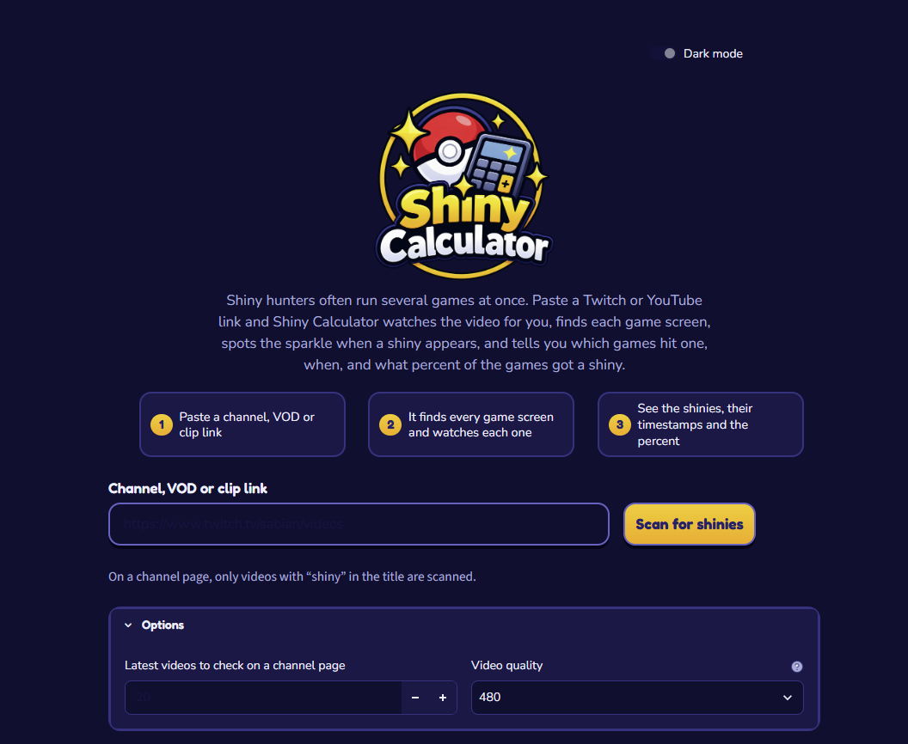

# Shiny Calculator

Scan Twitch and YouTube shiny hunt streams and find out which games hit a shiny, when it happened, and what percent of the games got one.



Shiny hunters often run several games at once. Paste a link and Shiny Calculator watches the video, finds each game screen, spots the shiny sparkle, and gives you a report.

## Features

- Works on a channel videos page, a single VOD, or a clip
- On a channel page, only scans videos with "shiny" (or a similar spelling, "sparkle", or a sparkle emoji) in the title
- Finds the game windows on its own and re-checks the layout every 5 minutes
- For each hit: the game (row and column), a timestamp link that opens the video at that moment, and a screenshot
- Shiny percentage across all games
- Light and dark mode
- Videos are streamed, not saved to disk

## Current limitations

This is an early release, so please read this before filing a bug.

- **Multi-game layouts only.** The scanner looks for several small, 3:2 game windows that stay in place (for example a grid of Game Boy Advance games). Streams that show a single large game, or a screen with a different shape, are reported as "No game screens found".
- **Gen 3 sparkle only.** A shiny is detected by the small white and yellow stars that appear when the Pokemon enters battle. It does not compare sprite colors.
- **Lightly tested.** It has been tested mainly on synthetic footage, so real streams may need threshold tuning.

If it misses a shiny or reports a false one, please open an issue (see Contributing).

## Quick start

1. Install [Python 3.10 or newer](https://www.python.org/downloads/). On Windows, tick **Add Python to PATH** during setup.
2. Get the code:

   ```bash
   git clone https://github.com/thattallguyyeli-dev/shiny-calculator.git
   cd shiny-calculator
   ```

   No git? Click **Code**, then **Download ZIP** on the GitHub page and extract it.
3. Start the app:
   - **Windows:** double-click `run.bat`
   - **macOS / Linux:** run `./run.sh` in a terminal

   The first run creates a virtual environment and installs everything, so it takes a minute.
4. Your browser opens at http://localhost:8501. Paste a Twitch or YouTube link, choose a video quality, and start the scan.

### Manual install

If you'd rather not use the launchers:

```powershell
python -m venv .venv
.venv\Scripts\Activate.ps1
pip install -r requirements.txt
streamlit run app.py
```

On macOS / Linux, activate with `source .venv/bin/activate` instead.

ffmpeg is bundled through `imageio-ffmpeg`, so you do not need to install it separately.

## How it works

1. `yt-dlp` turns the link into a direct stream address.
2. `ffmpeg` decodes frames at low resolution (480p by default).
3. Game windows are found by looking for solid 3:2 blocks that stay in place. Webcam and other tiles are ignored.
4. Only the enemy area of each window is watched. A hit is 3 or more small bright blobs that newly appear, in at least 2 of 3 consecutive samples. Full-area flashes are rejected, and if several windows sparkle within 3 seconds of each other, it is treated as a scene transition instead of a shiny.

Tuning values are at the top of `scanner.py` (`SAMPLE_FPS`, `ENEMY`, `CHUNK`) and in `scan_video(threshold=...)`.

## Project layout

```
shiny-calculator/
|-- app.py            Streamlit interface
|-- scanner.py        Video scanning and shiny detection
|-- requirements.txt  Python dependencies
|-- run.bat / run.sh  One-step launchers (Windows / macOS, Linux)
|-- assets/           Logo and screenshot
|-- .streamlit/       Streamlit theme config
|-- LICENSE           MIT
`-- README.md
```

## Troubleshooting

- **A link stops working:** Twitch and YouTube change often. Update the downloader with `pip install -U yt-dlp`.
- **"No game screens found":** the stream probably uses a layout the scanner does not recognize. See Current limitations.
- **Slow scans:** the whole video is decoded, so long VODs take a while. 720p catches smaller stars but is slower.
- **Hosting it online:** not recommended. Scans are heavy on CPU and bandwidth, and Twitch and YouTube often block requests from cloud servers. Running locally is the reliable way.

## Contributing

Issues and pull requests are welcome. The most useful thing you can send is a short clip or link of a known shiny, with the timestamp and a description of the stream layout.

## License

[MIT](LICENSE)

## Disclaimer

This tool only reads publicly available videos. Follow the terms of service of the platforms you use it with. It is not affiliated with or endorsed by Nintendo, Game Freak, The Pokemon Company, Twitch or YouTube. Pokemon and related names are trademarks of their respective owners.